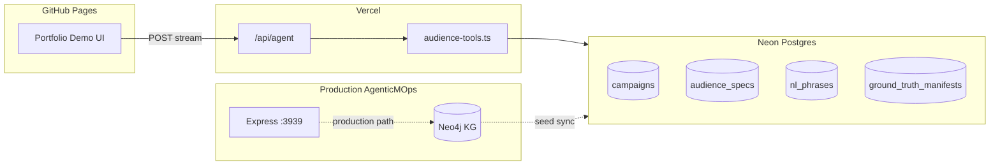

# MarTech Audience Agent — Context & Build Reference

> **Purpose:** Single source of truth for the Audience Agent demo (portfolio + AgenticMOps).  
> **Live demo:** [MarTech Audience Agent](index.html) · **Parent system:** [AgenticMOps](../agentic-mops/index.html)  
> **Author:** Gaurav Mehta · Staff PM, GTM Tech @ Intuit

---

## 1. Problem & Outcome

### Problem
Marketing Operations teams spend hours translating **SOT audience prose** (Google Slides / QuickBase) into **Segment CDP traits** for campaign launch. The work is repetitive, error-prone, and depends on tribal knowledge of sibling campaigns.

### Outcome the agent owns
A **Segment CDP audience** with validated count within **±20%** of the SOT estimate, backed by a documented **attribute manifest** with provenance (which sibling campaigns / NL mappings drove each trait).

### Guardrails (from AgenticMOps `AGENT.md`)
1. **KG-first** — sibling campaign attributes before external sources  
2. **Frequency wins** — prefer traits used by most siblings  
3. **Never fabricate** — mark unresolved criteria; do not invent trait names  
4. **Exact Segment names** — e.g. `qbo_skuName`, not generic labels  
5. **Count tolerance ±20%** of SOT `sizeEstimate`  
6. **Max 3 retries** on count mismatch before HITL  
7. **Log provenance** — sibling ELM IDs per trait  

---

## 2. Architecture

| Layer | Role |
|-------|------|
| **GitHub Pages** | Static demo UI (this portfolio) |
| **Vercel** | Agent runtime, LLM calls, secrets (`DATABASE_URL`, API keys) |
| **Neon Postgres** | Portable fixture DB — campaigns, specs, NL phrases, ground truth |
| **Neo4j KG** | Production substrate in AgenticMOps (7K+ campaigns, AudienceSpec nodes) |

**Important:** Neon is an **eval/demo mirror** of the KG subset the Audience Agent needs — not a replacement for Neo4j in production.

---

## 3. Agent Workflow (4 phases)

| Phase | Steps | What happens |
|-------|-------|--------------|
| **1 — Discovery** | Parse NL criteria → sibling mining → predecessor check → `nlPhrases` lookup | Map concepts to Segment traits via KG patterns |
| **2 — Manifest** | Frequency merge, suppressions, heuristics | Build attribute table with source tier per row |
| **3 — Build** | Always **Segment CDP** (Eloqua/CM consume via CDP sync) | Construct Segment expression; preview → create |
| **4 — Validate** | Count vs SOT ±20%; retry ≤3; HITL gate | Write-back to KG (`AudienceSpec`, `AttributeMapping.nlValidatedBy`) |

### Resolution tiers (per criterion)
- `resolved` — sibling frequency ≥ 2  
- `kg-phrase-match` — `nlPhrases` hit with HITL validation count ≥ 1  
- `kg-phrase-inferred` — seed-only phrase, low confidence  
- `unresolved` — escalate to HITL  

---

## 4. Tool API (Vercel semantic layer)

The agent does **not** write raw SQL. It calls **named tools** in `vercel/lib/audience-tools.ts`:

| Tool | Purpose |
|------|---------|
| `get_campaign_context` | Campaign + audience specs + parsed criteria by ELM |
| `find_sibling_campaigns` | Match goal / product / BU; trait frequency |
| `get_predecessor_audiences` | `depends_on` lineage |
| `lookup_nl_phrases` | Trigram search on NL → trait mappings |
| `get_expected_outcome` | Ground-truth manifest (eval mode) |
| `list_segment_traits` | Trait catalog validation |

**Route:** `POST /api/agent` — Vercel AI SDK `streamText` + `maxSteps: 8` + tools.

---

## 5. Neon Data Model

Schema: `AgenticMOps/scripts/sql/neon_schema.sql`

| Table | Purpose |
|-------|---------|
| `campaigns` | ELM metadata, goal, products, `sot_main_audience` |
| `audience_specs` | Segment criteria, traits[], size |
| `audience_criteria` | Parsed NL criterion rows |
| `attribute_mappings` | SOT name → system trait |
| `nl_phrases` | NL phrase index (`pg_trgm`) |
| `campaign_connections` | `depends_on`, `shares_audience`, etc. |
| `ground_truth_manifests` | Expected agent outcome JSON |
| `segment_traits` | Trait usage catalog |

### Seed stats (after full seed)
- ~**1,393** campaigns  
- ~**2,068** audience specs  
- ~**1,393** ground-truth manifests  
- ~**93** campaign connections (derived + Neo4j optional)  
- **64** NL phrases · **442** segment traits  

**Seed script:** `AgenticMOps/scripts/seed_neon_audience.py`  
**Validate:** `AgenticMOps/scripts/validate_neon_audience.py`

### Hero scenarios for demo
| ELM | Use case |
|-----|----------|
| **ELM-9949** | ESS+ Annual Save — Retain, churn, US (primary demo) |
| **ELM-5877** | MM Efficiency Bundle — Attach |
| **ELM-8533** | BI Nov Release — QBO Advanced |

---

## 6. GitHub Pages ↔ Vercel Integration

- **UI:** Static on `gmehta.github.io/GMEHTA-AI-PM/projects/martech-audience-agent/`  
- **API:** Vercel deployment (`AgenticMOps/vercel/`)  
- **CORS:** Vercel must allow `https://gmehta.github.io`  
- **Secrets:** Never in GitHub Pages — only Vercel env vars  
- **Stream formats:** Portfolio UI may need **compat SSE** adapter (`/api/agent/stream-compat`) because React bundle expects `data: {"content":...}` while AI SDK uses data stream parts including `tool_call` / `tool_result`

---

## 7. Traceability & Explainability

### What Vercel does *not* auto-provide
- No built-in “agent trace” UI for MOps provenance  
- Function logs only unless you add `onStepFinish` / client parsing  

### What the demo should show
1. **User-facing:** Attribute manifest with Source / Confidence / sibling ELMs  
2. **Engineer-facing:** Trace panel — tool timeline, Neon JSON evidence, provenance map  

### AI SDK stream includes
- `tool_call` / `tool_result` events — wire to Trace panel when UI is live  

---

## 8. UI Experience Design (demo skeleton)

### Page zones
1. **Hook** — 30s video placeholder + stat pills (2K audiences, 83%+ recall, ±20% tolerance)  
2. **Try it** — Scenario chips (ELM-9949, 5877, 8533) + Run + manifest output  
3. **Trace** — Timeline / Provenance / Data sources tabs  
4. **PM proof** — Problem → Insight → Bet, what shipped, metrics  

### Recommended prompt chips
- ESS+ Annual Save (ELM-9949)  
- MM Efficiency Bundle (ELM-5877)  
- BI Nov Release (ELM-8533)  
- Edge case: unresolved trait (HITL demo)  

---

## 9. LLM & Cost (demo)

| Provider | Notes |
|----------|-------|
| **Google Gemini 2.0 Flash** | Free tier via AI Studio; good tool calling for demo |
| **OpenAI gpt-4o-mini** | Current default in route; cheap, not free |
| **Groq** | Free tier alternative |

Change provider in `vercel/api/agent/route.ts` (`@ai-sdk/google`, etc.).

---

## 10. Security

- Rotate Neon password if connection string was exposed in chat  
- Set `DATABASE_URL` via `neonctl` or Vercel Neon integration — not committed  
- Lock CORS to GitHub Pages origin  
- Consider rate limiting on public Vercel endpoint  

---

## 11. File Index

| Path | Description |
|------|-------------|
| `projects/martech-audience-agent/index.html` | Build journal (Overview · Why · How · Live Demo tabs) |
| `projects/martech-audience-agent/tabs/demo.jsx` | Interactive demo shell (scripted trace; wire to Vercel next) |
| `projects/martech-audience-agent/audienceagent.md` | This document |
| `AgenticMOps/vercel/api/agent/route.ts` | Vercel agent route |
| `AgenticMOps/vercel/lib/audience-tools.ts` | SQL tool functions |
| `AgenticMOps/scripts/sql/neon_schema.sql` | Neon DDL |
| `AgenticMOps/scripts/seed_neon_audience.py` | ETL seed |
| `AgenticMOps/agents/audience-readiness/AGENT.md` | Canonical agent spec |

---

## 12. Roadmap

- [ ] Wire live Vercel API + CORS from demo UI  
- [ ] Stream-compat endpoint for GitHub Pages client  
- [ ] Trace panel fed by tool events  
- [ ] 30s intro video embed  
- [ ] Ground-truth diff toggle (eval mode)  
- [ ] Production path: Neo4j + Segment preview API  

---

## 13. Eval Baseline

From `AgenticMOps/scripts/output/audience_agent_eval_v2.json`:
- Baseline sibling mining: **~83%** mean attribute recall  
- +Tier1 artifact filtering: **~93%**  
- NL phrase test: `"us only"` → `geo_region`  
- ELM-9949 spot-check traits: `qbo_skuName`, `qbo_regionMD`, `qbo_charge_frequencyMD`, etc.

---

*Last updated: May 2026*
